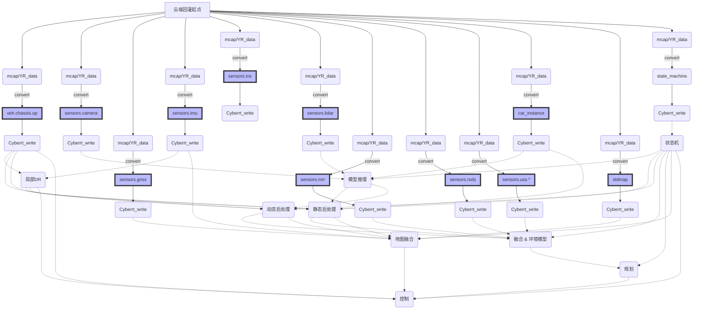

```mermaid
flowchart TB

chassis.up
camera  
gnss 
imu  
ins 
lidar  
mrr
rsds 
uss.*  

car_instance 
```

```mermaid
flowchart TB

云端回灌起点 --> A0("mcap/YR_data")  --convert--> veh.chassis.up("veh.chassis.up")  --> VCU("Cyberrt_write")
云端回灌起点 --> A1("mcap/YR_data")  --convert--> sensors.camera("sensors.camera")  --> SC("Cyberrt_write")
云端回灌起点 --> A2("mcap/YR_data")  --convert--> sensors.gnss("sensors.gnss")      --> SG("Cyberrt_write")
云端回灌起点 --> A3("mcap/YR_data")  --convert--> sensors.imu("sensors.imu")        --> SIMU("Cyberrt_write")
云端回灌起点 --> A4("mcap/YR_data")  --convert--> sensors.ins("sensors.ins")        --> SINS("Cyberrt_write")
云端回灌起点 --> A5("mcap/YR_data")  --convert--> sensors.lidar("sensors.lidar")    --> SL("Cyberrt_write")
云端回灌起点 --> A6("mcap/YR_data")  --convert--> sensors.mrr("sensors.mrr")        --> SM("Cyberrt_write")
云端回灌起点 --> A7("mcap/YR_data")  --convert--> sensors.rsds("sensors.rsds")      --> SR("Cyberrt_write")
云端回灌起点 --> A8("mcap/YR_data")  --convert--> sensors.uss.*("sensors.uss.*")    --> SU("Cyberrt_write")
云端回灌起点 --> A9("mcap/YR_data")  --convert--> car_instance("car_instance")      --> CI("Cyberrt_write")
云端回灌起点 --> A10("mcap/YR_data") --convert--> stdmap("stdmap")                  --> SMAP("Cyberrt_write")
云端回灌起点 --> A11("mcap/YR_data") --convert--> state_machine("state_machine")    --> SMACH("Cyberrt_write")

subgraph veh.chassis.up
    direction TB
    style veh.chassis.up fill:#bbf,stroke:#333,stroke-width:4px
end 
subgraph sensors.camera
    direction TB
    style sensors.camera fill:#bbf,stroke:#333,stroke-width:4px
end 
subgraph sensors.gnss
    direction TB
    style sensors.gnss fill:#bbf,stroke:#333,stroke-width:4px
end 
subgraph sensors.imu
    direction TB
    style sensors.imu fill:#bbf,stroke:#333,stroke-width:4px
end 

subgraph sensors.ins
    direction TB
    style sensors.ins fill:#bbf,stroke:#333,stroke-width:4px
end 

subgraph sensors.lidar
    direction TB
    style sensors.lidar fill:#bbf,stroke:#333,stroke-width:4px
end 

subgraph sensors.mrr
    direction TB
    style sensors.mrr fill:#bbf,stroke:#333,stroke-width:4px
end 

subgraph sensors.rsds
    direction TB
    style sensors.rsds fill:#bbf,stroke:#333,stroke-width:4px
end 

subgraph sensors.uss.*
    direction TB
    style sensors.uss.* fill:#bbf,stroke:#333,stroke-width:4px
end 

subgraph car_instance
    direction TB
    style car_instance fill:#bbf,stroke:#333,stroke-width:4px
end 

subgraph stdmap
    direction TB
    style stdmap fill:#bbf,stroke:#333,stroke-width:4px
end 

SMACH("Cyberrt_write") -.-> CSM("状态机")    


SL("Cyberrt_write")    -.-> CNN("模型推理")    
SC("Cyberrt_write")    -.-> CNN("模型推理")     
CI("Cyberrt_write")    -.-> CNN("模型推理")                            
CSM("状态机")           -.-> CNN("模型推理") 

VCU("Cyberrt_write")  -.-> CDR("局部DR") 
SIMU("Cyberrt_write") -.-> CDR("局部DR") 

CI("Cyberrt_write")   -.-> CPOS("静态后处理")                             
VCU("Cyberrt_write")  -.-> CPOS("静态后处理")  
CNN("模型推理")        -.-> CPOS("静态后处理")                                                 
CDR("局部DR")         -.-> CPOS("静态后处理")  
CSM("状态机")          -.-> CPOS("静态后处理")  

VCU("Cyberrt_write")   -.-> CPOD("动态后处理")  
CNN("模型推理")         -.-> CPOD("动态后处理") 
CDR("局部DR")          -.-> CPOD("动态后处理")   
CSM("状态机")          -.-> CPOD("动态后处理")   

SM("Cyberrt_write")     -.-> CPF("融合 & 环境模型")  
SR("Cyberrt_write")     -.-> CPF("融合 & 环境模型")  
SU("Cyberrt_write")     -.-> CPF("融合 & 环境模型")  
CPOD("动态后处理")        -.-> CPF("融合 & 环境模型")  
CPOS("静态后处理")        -.-> CPF("融合 & 环境模型")  
CSM("状态机")            -.-> CPF("融合 & 环境模型")  

CPF("融合 & 环境模型")  -.-> CPL("规划")  
CSM("状态机")         -.-> CPL("规划")  


SG("Cyberrt_write")    -.-> CMAP("地图融合")
SIMU("Cyberrt_write")  -.-> CMAP("地图融合")
SMAP("Cyberrt_write")  -.-> CMAP("地图融合")  
CPOS("静态后处理")       -.-> CMAP("地图融合")
CPOD("动态后处理")       -.-> CMAP("地图融合")
CSM("状态机")           -.-> CMAP("地图融合")

VCU("Cyberrt_write") -.-> CCO("控制") 
CDR("局部DR")         -.-> CCO("控制") 
CPL("规划")           -.-> CCO("控制") 
CMAP("地图融合")      -.-> CCO("控制") 
CSM("状态机")         -.-> CCO("控制") 


```

