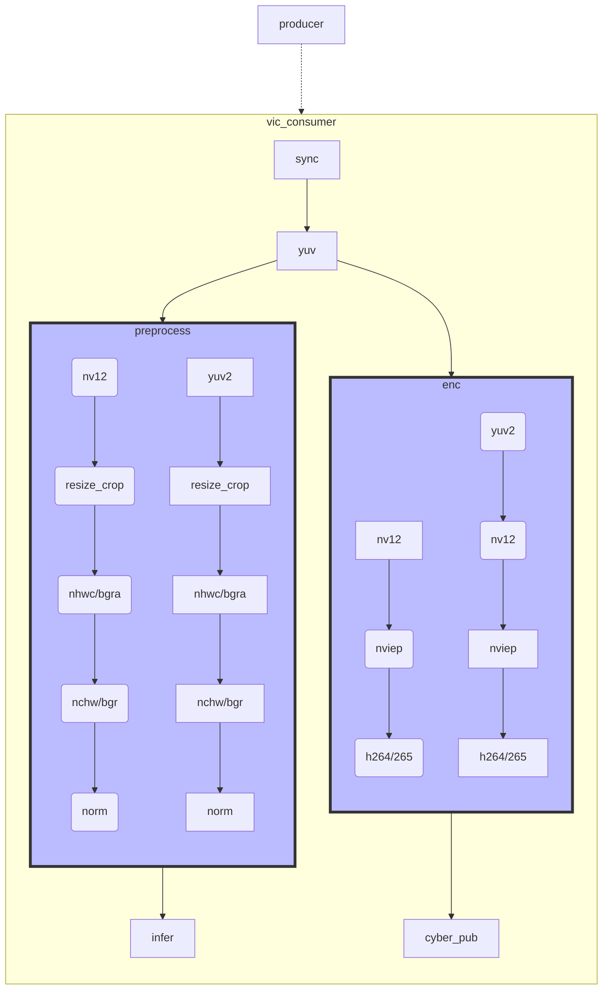

本文介绍pil replay。

```mermaid
flowchart TB

producer -..-> vic_consumer 

subgraph vic_consumer
    direction TB
    style preprocess fill:#111,stroke:#000,stroke-width:4px
    sync --> yuv --> preprocess --> infer
    yuv --> enc --> cyber_pub
end 

subgraph preprocess
    direction TB
    style preprocess fill:#bbf,stroke:#333,stroke-width:4px
    A1(nv12) --> A2(resize_crop) --> A3(nhwc/bgra) --> A4(nchw/bgr) --> A5(norm) 
    yuv2 --> resize_crop --> nhwc/bgra --> nchw/bgr  --> norm

end 

subgraph enc
    direction TB
    style enc fill:#bbf,stroke:#333,stroke-width:4px
    nv12 --> X(nviep) --> Y(h264/265)
    B1(yuv2) --> B2(nv12) --> nviep --> h264/265
end   

```

