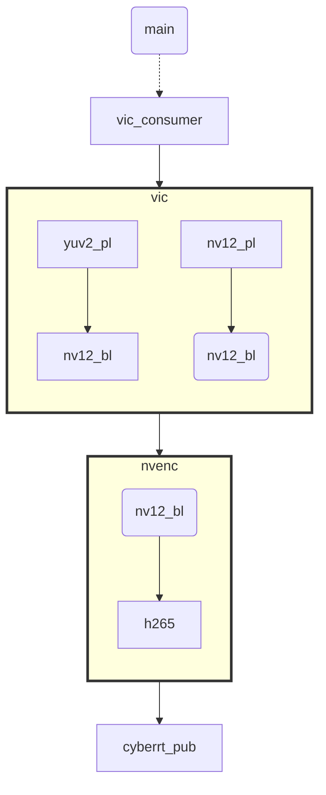

本文记录使用VIC 进行YUVx 到NV12 的格式转换，然后作为输入送到 NVENC 进行h265编码。        
>注： 
>    关于其他resize,crop等操作可参考nv sample           
>    本文软件环境 drive os 6060    


假设 multicast 接收到的是 yuyv-pl 的 nv12-pl 数据 
而 NVENC 要求的输入格式为 nv12-bl 
nv12-pl 需要验证确认

## 1，pipeline    


+ vic_out & nvenc src buf 进行协调属性设置   
+ nvenc dst buf 需要设置 cpu 可访问，因为最后需要降h265 的数据拷贝到 proto msg中。      


## 2，vic 仅做 格式转换的核心代码     

```cpp 
NvMedia2DComposeParameters params;
NvMedia2DGetComposeParameters(handle, &params);
NvMedia2DSetSrcNvSciBufObj(handle, params, 0, srcBuf);
NvMedia2DSetDstNvSciBufObj(handle, params, dstBuf);
NvMedia2DCompose(handle, params, NULL);
```

https://developer.nvidia.com/docs/drive/drive-os/6.0.6/public/drive-os-linux-sdk/api_reference/group__x__nvmedia__2d__api.html#gae58a626650f2e7679c9be4904c22553b

